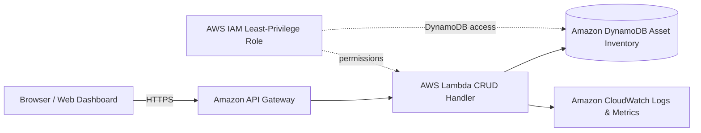
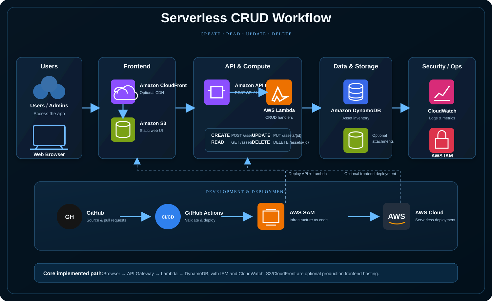

# CloudOps Asset Manager

A serverless AWS CRUD application for managing cloud and IT assets. Built with API Gateway, Lambda, DynamoDB, IAM, and CloudWatch, featuring a web dashboard for creating, viewing, updating, and deleting assets.

## What it does

CloudOps Asset Manager provides an inventory system for cloud and IT resources. Operators can create asset records, view inventory, update asset metadata and status, and delete retired assets.

## Application Flow Chart

```mermaid
flowchart LR
    U[CloudOps User] --> D[Web Dashboard]
    D --> C{CRUD Action}
    C -->|Create| P[POST /assets]
    C -->|Read| G[GET /assets]
    C -->|Update| T[PUT /assets/{assetId}]
    C -->|Delete| X[DELETE /assets/{assetId}]
    P --> R[API Response]
    G --> R
    T --> R
    X --> R
    R --> D
```

## AWS Architecture Diagram



### Polished AWS architecture drawing



The polished drawing keeps the implemented core path — Browser → API Gateway → Lambda → DynamoDB with IAM and CloudWatch — and shows S3/CloudFront frontend hosting only as an optional production extension.

The two diagrams are intentionally separate: the first explains the user's CRUD workflow, while the second explains the AWS implementation.

## CRUD API

| Operation | Method | Endpoint |
|---|---|---|
| Create | POST | `/assets` |
| Read all | GET | `/assets` |
| Read one | GET | `/assets/{assetId}` |
| Update | PUT | `/assets/{assetId}` |
| Delete | DELETE | `/assets/{assetId}` |

## Example asset

```json
{
  "assetId": "generated-uuid",
  "name": "Production-Web-01",
  "type": "EC2 Instance",
  "environment": "Production",
  "region": "us-east-2",
  "owner": "Cloud Operations",
  "status": "Active"
}
```

## AWS services

- Amazon API Gateway — HTTP API entry point
- AWS Lambda — serverless CRUD logic
- Amazon DynamoDB — asset inventory database
- AWS IAM — least-privilege access control
- Amazon CloudWatch — logs and monitoring
- AWS SAM — infrastructure as code and deployment

## Project structure

```text
cloudops-asset-manager/
├── backend/app.py
├── frontend/index.html
├── frontend/app.js
├── frontend/styles.css
├── docs/architecture.md
├── docs/api.md
├── docs/cloudops-asset-manager-aws-architecture.svg
├── template.yaml
├── README.md
└── .gitignore
```

## Deploy

```bash
sam build
sam deploy --guided
```

The stack outputs the API endpoint. Configure the frontend with that endpoint after deployment.

## Portfolio skills demonstrated

Serverless application development, REST API design, Lambda, DynamoDB data modeling, infrastructure as code, IAM security, CloudWatch monitoring, frontend-to-API integration, and complete CRUD functionality.
