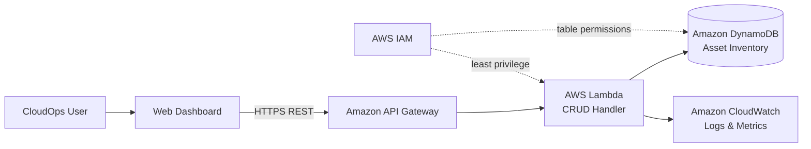
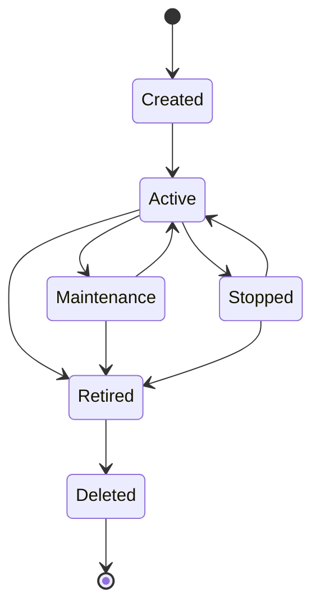

# CloudOps Asset Manager Architecture

## Production architecture

## Request flow

1. A CloudOps user manages assets from the browser dashboard.
2. The dashboard sends HTTPS requests to API Gateway.
3. API Gateway routes POST, GET, PUT, and DELETE requests to Lambda.
4. Lambda validates the request and performs the corresponding DynamoDB operation.
5. DynamoDB stores asset inventory records using `assetId` as the partition key.
6. CloudWatch captures Lambda logs and operational information.
7. IAM limits the Lambda execution role to the permissions required by the application.

## CRUD mapping

| User action | HTTP | Lambda operation | DynamoDB operation |
|---|---|---|---|
| Add asset | POST `/assets` | Create | PutItem |
| View inventory | GET `/assets` | Read | Scan |
| View asset | GET `/assets/{assetId}` | Read | GetItem |
| Edit asset | PUT `/assets/{assetId}` | Update | PutItem |
| Remove asset | DELETE `/assets/{assetId}` | Delete | DeleteItem |

## Asset lifecycle

The repository can be reviewed without an active AWS deployment. `template.yaml` represents the deployable infrastructure, while the frontend contains the dashboard that will connect to the API after deployment.
